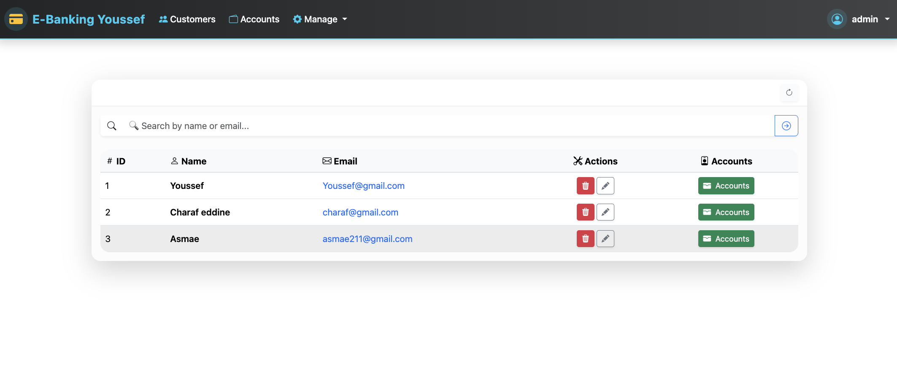
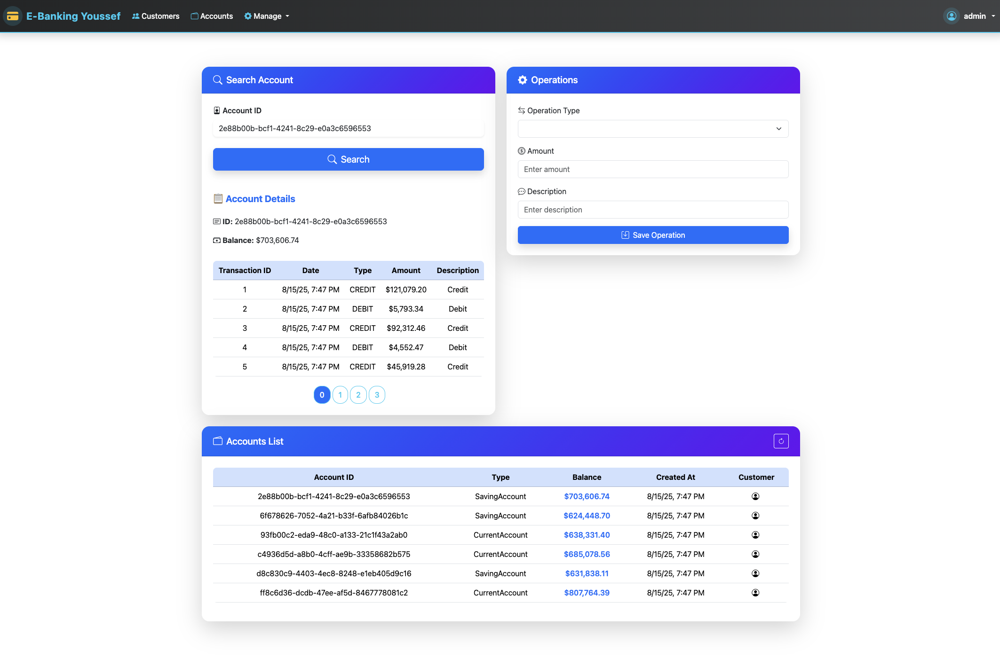
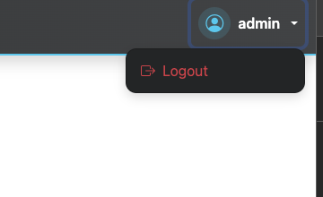

# 🏦 Application de Gestion des Comptes Bancaires

Une application web complète pour la gestion de comptes bancaires, développée avec **Spring Boot** pour le backend et **Angular** pour le frontend.  
L'application prend en charge l'authentification sécurisée à l'aide de **Spring Security** et **JSON Web Token (JWT)**.

---

## 🎯 Objectif du Projet

Ce projet permet de :

- Gérer les **clients** et leurs **comptes bancaires**
- Réaliser des opérations de **crédit**, **débit**, et **virement**
- Consulter l’historique des opérations
- Supporter deux types de comptes : **courants** et **épargnes**
- Sécuriser l'accès aux services avec **authentification JWT**
  
---

## 🧰 Technologies utilisées

| Couche         | Technologies principales                      |
|----------------|-----------------------------------------------|
| Backend        | Spring Boot 3, Spring Data JPA, Lombok ...    |
| Base de données| MySQL (via WAMP Server)                       |
| Frontend       | Angular , Bootstrap , CSS                     |
| Sécurité       | Spring Security, JSON Web Token (JWT)         |
| Documentation  | Swagger (springdoc-openapi)  v3               |
| Autres outils  | Maven, Postman, Git, IntelliJ / VSCode        |

---


## 📂 Structure du projet
```
ebanking/
│
├── server/
│   └── src/main/java/net/bd/ebankingbackend/
│       ├── dtos/
│       ├── entities/
│       ├── enums/
│       ├── exceptions/
│       ├── mappers/
│       ├── repositories/
│       ├── security/
│       ├── services/
│       └── web/

│
├── client/
│   └── angular-bank-app/
│       ├── components/
│       └── services/
│
└── README.md
```
### 👇 Captures d'écran principales

#### Page de login


> 📸 *Pour se connecter, utilisez :*
> - **admin / 1234** *(rôle ADMIN)*
> - **user1 / 1234** *(rôle USER)*

---

#### Liste des clients



---

#### Liste des comptes



---

#### Déconnexion



## 🧭 Navigation

- `/login` : Page de connexion
- `/admin/customers` : Liste des clients
- `/admin/accounts` : Liste des comptes
